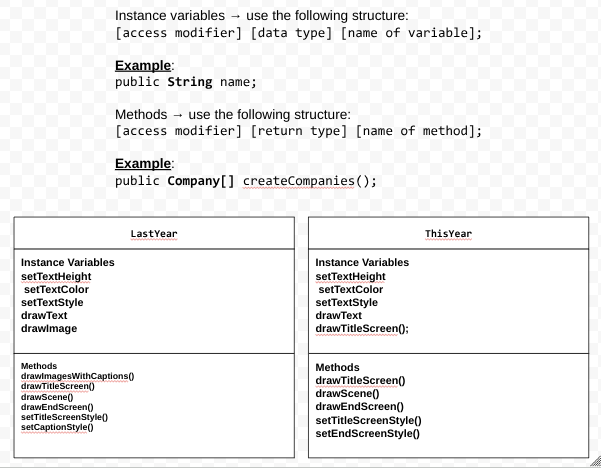

# Abstract-Data-Art-Project
# Project: New Scene, New Me

## Introduction

Software engineers develop programs to create visual and audio experiences using object-oriented programming. As we begin 2026, your goal is to create an animation program that reflects on your experiences from 2025 and visualizes your goals and aspirations for the year ahead using the Theater and Scene API.

## Requirements

Use your knowledge of object-oriented programming, one-dimensional (1D) arrays, algorithms, and the Theater/Scene API to create your animation program:
- **Write Scene subclasses** – Create two Scene subclasses: one to visualize your 2025 recap (LastYear) and another to project your 2026 goals (ThisYear). Each class must include both a no-argument constructor and a parameterized constructor.
- **Use private instance variables** – Implement proper encapsulation by declaring instance variables as private in your Scene subclasses.
- **Create 1D arrays** – Create at least two 1D arrays to store data for your scenes. One array must be created using an initializer list, and one array must be populated by reading from a text file using the FileReader class.
- **Write a method** – Write a method that finds or manipulates the elements in a 1D array to provide the information your user needs.
- **Access and modify array elements** – Use algorithms to traverse, access, and/or modify elements in your 1D arrays to display personalized content in your scenes.
- **Use logic and iteration** – Incorporate selection statements (if/if-else) and loops (while, for, or enhanced for) to control the flow and display of content in your scenes.
Incorporate variety of media – Use at least four different types of Scene API methods across both scenes (examples: drawImage(), drawText(), drawRectangle(), drawEllipse(), playSound(), setTextStyle(), setFillColor(), etc.).
- **Create a UML diagram** – Design a UML class diagram showing your Scene subclasses with their instance variables, constructors, and methods before you begin coding.
- **Document your code** – Use multi-line comments to explain the purpose of each method (including preconditions and postconditions) and single-line comments to explain code segments.

## UML Diagram 

Put an image of your UML Diagram here. Upload the image of your UML Diagram to your repository, then use the Markdown syntax to insert your image here. Make sure your image file name is one work, otherwise it might not properly get displayed on this README. 

 

## Description of 2025 recap

In my 2025 recap scene, I included pictures of my friends as I spent most of the year with them, my sweet sixteen as it was the highlight of the year, and my dog because he made my 2025 year better.

## Description of 2026 goals
In my 2026, goals scene, I added 4-5 goals I wanted to accomplish this upcoming year. I wrote to get better at running, practice piano, get into cooking, etc.

## Scene API Usage

I used various methods like drawTitleScreen, drawScreen, drawEndScreen, setTitleScreenStyle, setEndScreenStyle, drawImagesWithCaptions, and setCaptionStyle. The drawTitleScreen was used to draw out the title Screen with the words "2025 Recap" after the setTitleScreenStyle set the height, color, and font style. The setCaptionStyle set the height, color, and font of the captions. Then, the drawImagesWithCaptions was used to draw the images that I imported with the captions that I set up. The set and draw End Screens did the same thing but this was for the ending to say "Goodbye 2025" before switching over to my 2026 goals.